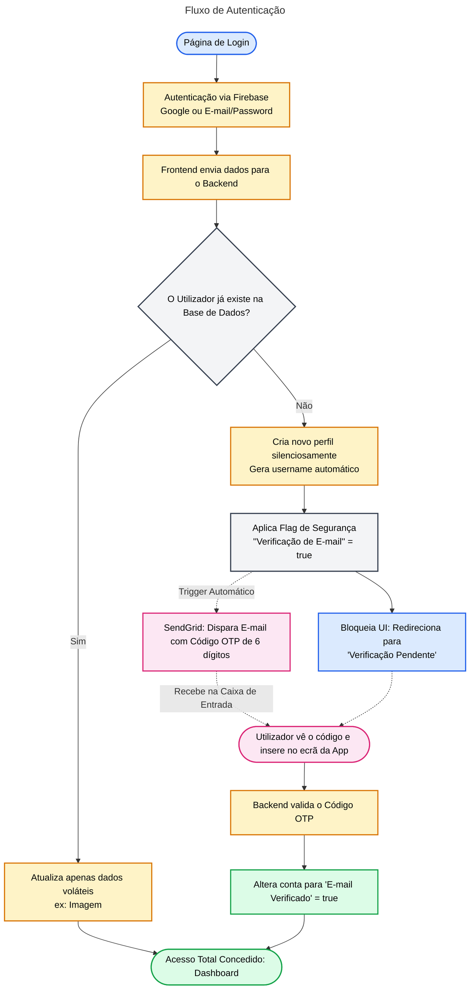

```mermaid
---
title: Fluxo de Autenticação
---
graph TD
    %% 1. ESTILOS
    classDef ui fill:#dbeafe,stroke:#2563eb,stroke-width:2px,color:#000
    classDef api fill:#fef3c7,stroke:#d97706,stroke-width:2px,color:#000
    classDef decisao fill:#f3f4f6,stroke:#374151,stroke-width:2px,color:#000
    classDef alerta fill:#fee2e2,stroke:#dc2626,stroke-width:2px,color:#000
    classDef email fill:#fce7f3,stroke:#db2777,stroke-width:2px,color:#000
    classDef sucesso fill:#dcfce7,stroke:#16a34a,stroke-width:2px,color:#000

    %% 2. CAIXAS
    A([Página de Login])
    B[Autenticação via Firebase<br>Google ou E-mail/Password]
    C[Frontend envia dados para o Backend]
    
    D{O Utilizador já existe na Base de Dados?}
    
    %% Ramo: Já existe
    E[Atualiza apenas dados voláteis<br>ex: Imagem]
    F([Acesso Total Concedido: Dashboard])
    
    %% Ramo: Novo
    G[Cria novo perfil silenciosamente<br>Gera username automático]
    H[Aplica Flag de Segurança<br>''Verificação de E-mail'' = true]
    I[Bloqueia UI: Redireciona para<br>'Verificação Pendente']
    
    %% Barreira de Segurança
    J[SendGrid: Dispara E-mail com Código OTP de 6 dígitos]
    K([Utilizador vê o código e insere no ecrã da App])
    L[Backend valida o Código OTP]
    M[Altera conta para 'E-mail Verificado' = true]

    %% 3. LIGAÇÕES
    A --> B
    B --> C
    C --> D
    
    %% Caminho do Antigo
    D -->|Sim| E
    E --> F
    
    %% Caminho do Novo
    D -->|Não| G
    G --> H
    H --> I
    
    %% Ação em Background vs Ação do Utilizador
    H -.->|Trigger Automático| J
    J -.->|Recebe na Caixa de Entrada| K
    I -.-> K
    
    %% Resolução
    K --> L
    L --> M
    M --> F

    %% 4. APLICAR CORES
    class A,I ui;
    class B,C,E,G,L api;
    class D,H decisao;
    class J,K email;
    class F,M sucesso;
```