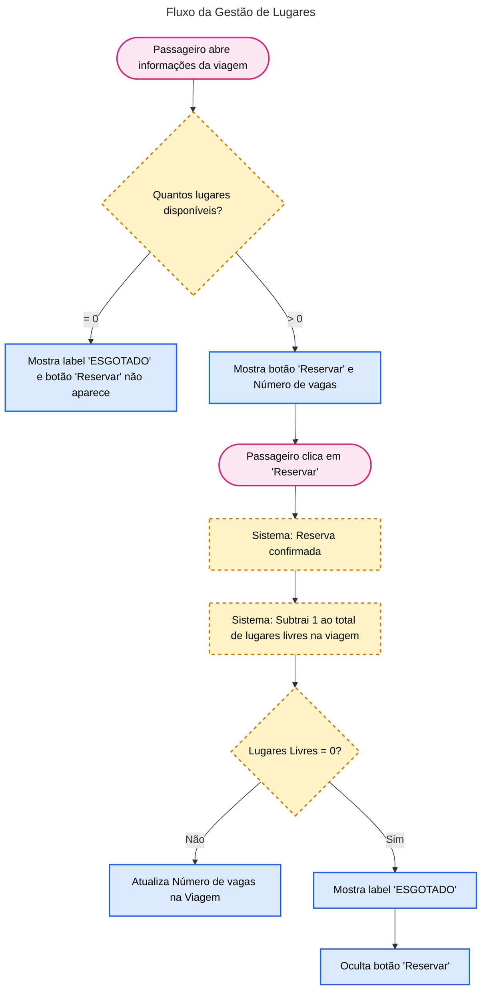

```mermaid
---
title: Fluxo da Gestão de Lugares
---
graph TD
    %% 1. ESTILOS
    classDef passageiro fill:#fce7f3,stroke:#db2777,stroke-width:2px,color:#000
    classDef sistema fill:#fef3c7,stroke:#d97706,stroke-width:2px,stroke-dasharray: 5 5,color:#000
    classDef interface fill:#dbeafe,stroke:#2563eb,stroke-width:2px,color:#000

    %% 2. CAIXAS
    A([Passageiro abre informações da viagem])
    B{Quantos lugares disponíveis?}
    
    %% Caminho: Já não há lugares quando abre os detalhes da viagem
    I[Mostra label 'ESGOTADO' e botão 'Reservar' não aparece]
    
    %% Caminho: Há lugares quando abre os detalhes da viagem
    J[Mostra botão 'Reservar' e Número de vagas]
    K([Passageiro clica em 'Reservar'])
    
    C[Sistema: Reserva confirmada]
    D[Sistema: Subtrai 1 ao total de lugares livres na viagem]
    E{Lugares Livres = 0?}
    
    F[Atualiza Número de vagas na Viagem]
    G[Mostra label 'ESGOTADO']
    H[Oculta botão 'Reservar']

    %% 3. LIGAÇÕES
    A --> B
    
    B -->|= 0| I
    
    B -->|> 0| J
    J --> K
    K --> C
    C --> D
    D --> E
    
    E -->|Não| F
    E -->|Sim| G
    G --> H

    %% 4. CORES
    class A,K passageiro;
    class B,C,D,E sistema;
    class F,G,H,I,J interface;
```