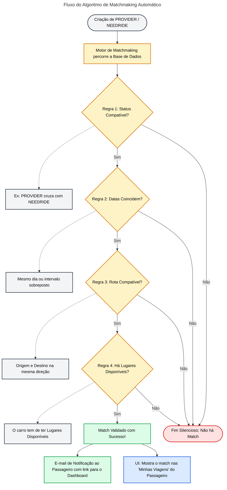

```mermaid
---
title: Fluxo do Algoritmo de Matchmaking Automático
---
graph TD
    %% 1. ESTILOS (CORES)
    classDef gatilho fill:#f3f4f6,stroke:#374151,stroke-width:2px,color:#000
    classDef verificacao fill:#fef3c7,stroke:#d97706,stroke-width:2px,color:#000
    classDef sucesso fill:#dcfce7,stroke:#16a34a,stroke-width:2px,color:#000
    classDef falha fill:#fee2e2,stroke:#dc2626,stroke-width:2px,color:#000
    classDef ui fill:#dbeafe,stroke:#2563eb,stroke-width:2px,color:#000

    %% 2. DECLARAR AS CAIXAS (Sem setas ainda)
    A([Criação de PROVIDER / NEEDRIDE])
    B[Motor de Matchmaking percorre a Base de Dados]
    
    C{Regra 1: Status Compatível?}
    C_Info[Ex: PROVIDER cruza com NEEDRIDE]
    
    D{Regra 2: Datas Coincidem?}
    D_Info[Mesmo dia ou intervalo sobreposto]
    
    E{Regra 3: Rota Compatível?}
    E_Info[Origem e Destino na mesma direção]

    F{Regra 4: Há Lugares Disponíveis?}
    F_Info[O carro tem de ter Lugares Disponíveis]

    G([Fim Silencioso: Não há Match])
    
    H[Match Validado com Sucesso!]
    I[E-mail de Notificação ao Passageiro com link para o Dashboard]
    J[UI: Mostra o match nas 'Minhas Viagens' do Passageiro]

    %% 3. FAZER AS LIGAÇÕES (Setas)
    A --> B
    B --> C
    
    %% O Algoritmo
    C -.-> C_Info
    C -->|Sim| D
    C -->|Não| G
    
    D -.-> D_Info
    D -->|Sim| E
    D -->|Não| G
    
    E -.-> E_Info
    E -->|Sim| F
    E -->|Não| G

    F -.-> F_Info
    F -->|Sim| H
    F -->|Não| G

    %% Conclusão
    H --> I
    H --> J

    %% 4. APLICAR AS CORES (Sem ponto e vírgula no fim)
    class A gatilho
    class B,C,D,E,F verificacao
    class C_Info,D_Info,E_Info,F_Info gatilho
    class H,I sucesso
    class G falha
    class J ui
```