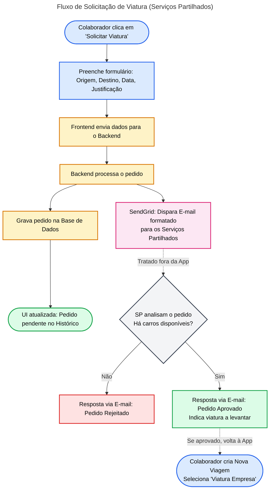

```mermaid
---
title: Fluxo de Solicitação de Viatura (Serviços Partilhados)
---
graph TD
    %% 1. ESTILOS
    classDef ui fill:#dbeafe,stroke:#2563eb,stroke-width:2px,color:#000
    classDef api fill:#fef3c7,stroke:#d97706,stroke-width:2px,color:#000
    classDef decisao fill:#f3f4f6,stroke:#374151,stroke-width:2px,color:#000
    classDef alerta fill:#fee2e2,stroke:#dc2626,stroke-width:2px,color:#000
    classDef email fill:#fce7f3,stroke:#db2777,stroke-width:2px,color:#000
    classDef sucesso fill:#dcfce7,stroke:#16a34a,stroke-width:2px,color:#000

    %% 2. CAIXAS
    A([Colaborador clica em 'Solicitar Viatura'])
    B[Preenche formulário: Origem, Destino, Data, Justificação]
    C[Frontend envia dados para o Backend]
    
    D[Backend processa o pedido]
    
    %% Ramo: Base de Dados (Histórico)
    E[Grava pedido na Base de Dados]
    F([UI atualizada: Pedido pendente no Histórico])
    
    %% Ramo: Envio de E-mail
    G[SendGrid: Dispara E-mail formatado<br>para os Serviços Partilhados]
    
    %% Barreira Externa (Fora da App)
    H{SP analisam o pedido<br>Há carros disponíveis?}
    
    %% Decisões dos SP
    I[Resposta via E-mail: Pedido Rejeitado]
    J[Resposta via E-mail: Pedido Aprovado<br>Indica viatura a levantar]
    
    %% Ação Final
    K([Colaborador cria Nova Viagem<br>Seleciona 'Viatura Empresa'])

    %% 3. LIGAÇÕES
    A --> B
    B --> C
    C --> D
    
    %% Ações simultâneas do Backend
    D --> E
    D --> G
    
    E --> F
    
    %% Fluxo Externo à App
    G -.->|Tratado fora da App| H
    
    H -->|Não| I
    H -->|Sim| J
    
    %% Volta à App
    J -.->|Se aprovado, volta à App| K

    %% 4. APLICAR CORES
    class A,B,K ui;
    class C,D,E api;
    class H decisao;
    class G,I,J email;
    class F sucesso;
    class I alerta;
    class J sucesso;
```