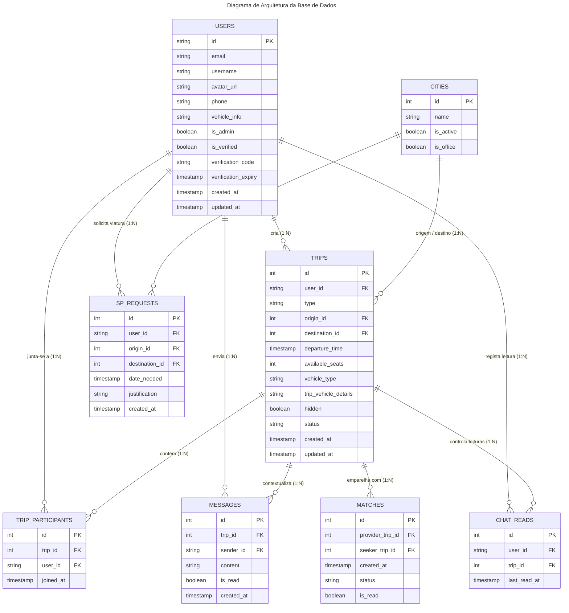

```mermaid
---
title: Diagrama de Arquitetura da Base de Dados
---
erDiagram
    %% Tabelas e Atributos Principais
    USERS {
        string id PK
        string email
        string username
        string avatar_url
        string phone
        string vehicle_info
        boolean is_admin
        boolean is_verified
        string verification_code
        timestamp verification_expiry
        timestamp created_at
        timestamp updated_at
    }

    CITIES {
        int id PK
        string name
        boolean is_active
        boolean is_office
    }

    TRIPS {
        int id PK
        string user_id FK
        string type
        int origin_id FK
        int destination_id FK
        timestamp departure_time
        int available_seats
        string vehicle_type 
        string trip_vehicle_details 
        boolean hidden
        string status 
        timestamp created_at
        timestamp updated_at
    }

    SP_REQUESTS {
        int id PK
        string user_id FK
        int origin_id FK
        int destination_id FK
        timestamp date_needed 
        string justification 
        timestamp created_at 
    }

    TRIP_PARTICIPANTS {
        int id PK
        int trip_id FK
        string user_id FK
        timestamp joined_at
    }

    MATCHES {
        int id PK
        int provider_trip_id FK
        int seeker_trip_id FK
        timestamp created_at
        string status
        boolean is_read
    }

    CHAT_READS {
        int id PK
        string user_id FK
        int trip_id FK
        timestamp last_read_at
    }

    MESSAGES {
        int id PK
        int trip_id FK
        string sender_id FK
        string content
        boolean is_read
        timestamp created_at
    }

    %% Relações (Foreign Keys)
    USERS ||--o{ TRIPS : "cria (1:N)"
    USERS ||--o{ TRIP_PARTICIPANTS : "junta-se a (1:N)"
    USERS ||--o{ MESSAGES : "envia (1:N)"
    USERS ||--o{ SP_REQUESTS : "solicita viatura (1:N)"
    USERS ||--o{ CHAT_READS : "regista leitura (1:N)"
    
    TRIPS ||--o{ TRIP_PARTICIPANTS : "contém (1:N)"
    TRIPS ||--o{ MESSAGES : "contextualiza (1:N)"
    TRIPS ||--o{ MATCHES : "emparelha com (1:N)"
    TRIPS ||--o{ CHAT_READS : "controla leituras (1:N)"
    
    CITIES ||--o{ TRIPS : "origem / destino (1:N)"
    CITIES ||--o{ SP_REQUESTS : "origem / destino (1:N)"
```