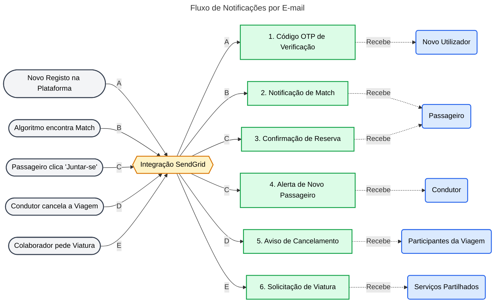

```mermaid
---
title: Fluxo de Notificações por E-mail
---
graph LR
    %% 1. ESTILOS
    classDef gatilho fill:#f3f4f6,stroke:#374151,stroke-width:2px,color:#000
    classDef api fill:#fef3c7,stroke:#d97706,stroke-width:2px,color:#000
    classDef email fill:#dcfce7,stroke:#16a34a,stroke-width:2px,color:#000
    classDef user fill:#dbeafe,stroke:#2563eb,stroke-width:2px,color:#000

    %% 2. GATILHOS (O que acontece na App)
    G1([Novo Registo na Plataforma])
    G2([Algoritmo encontra Match])
    G3([Passageiro clica 'Juntar-se'])
    G4([Condutor cancela a Viagem])
    G5([Colaborador pede Viatura])

    %% 3. MOTOR
    API{{Integração SendGrid}}

    %% 4. TIPOS DE E-MAIL
    M1[1. Código OTP de Verificação]
    M2[2. Notificação de Match]
    M3[3. Confirmação de Reserva]
    M4[4. Alerta de Novo Passageiro]
    M5[5. Aviso de Cancelamento]
    M6[6. Solicitação de Viatura]

    %% 5. DESTINATÁRIOS
    U1(Novo Utilizador)
    U2(Passageiro)
    U3(Condutor)
    U4(Participantes da Viagem)
    U5(Serviços Partilhados)

    %% 6. O FLUXO LÓGICO COM IDENTIFICADORES (A, B, C, D, E)
    G1 -->|A| API
    API -->|A| M1 -.->|Recebe| U1
    
    G2 -->|B| API
    API -->|B| M2 -.->|Recebe| U2
    
    %% O fluxo C divide-se em dois e-mails
    G3 -->|C| API
    API -->|C| M3 -.->|Recebe| U2
    API -->|C| M4 -.->|Recebe| U3
    
    G4 -->|D| API
    API -->|D| M5 -.->|Recebe| U4
    
    %% O novo fluxo E
    G5 -->|E| API
    API -->|E| M6 -.->|Recebe| U5

    %% 7. APLICAR CORES
    class G1,G2,G3,G4,G5 gatilho;
    class API api;
    class M1,M2,M3,M4,M5,M6 email;
    class U1,U2,U3,U4,U5 user;
```