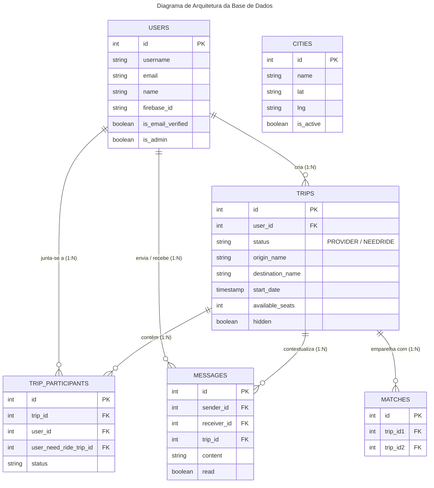

```mermaid
---
title: Diagrama de Arquitetura da Base de Dados
---
erDiagram
    %% Tabelas e Atributos Principais
    USERS {
        int id PK
        string username
        string email
        string name
        string firebase_id
        boolean is_email_verified
        boolean is_admin
    }

    TRIPS {
        int id PK
        int user_id FK
        string status "PROVIDER / NEEDRIDE"
        string origin_name
        string destination_name
        timestamp start_date
        int available_seats
        boolean hidden
    }

    TRIP_PARTICIPANTS {
        int id PK
        int trip_id FK
        int user_id FK
        int user_need_ride_trip_id FK
        string status
    }

    MESSAGES {
        int id PK
        int sender_id FK
        int receiver_id FK
        int trip_id FK
        string content
        boolean read
    }

    MATCHES {
        int id PK
        int trip_id1 FK
        int trip_id2 FK
    }

    CITIES {
        int id PK
        string name
        string lat
        string lng
        boolean is_active
    }

    %% Relações (Foreign Keys)
    USERS ||--o{ TRIPS : "cria (1:N)"
    USERS ||--o{ TRIP_PARTICIPANTS : "junta-se a (1:N)"
    USERS ||--o{ MESSAGES : "envia / recebe (1:N)"
    
    TRIPS ||--o{ TRIP_PARTICIPANTS : "contém (1:N)"
    TRIPS ||--o{ MESSAGES : "contextualiza (1:N)"
    TRIPS ||--o{ MATCHES : "emparelha com (1:N)"
```