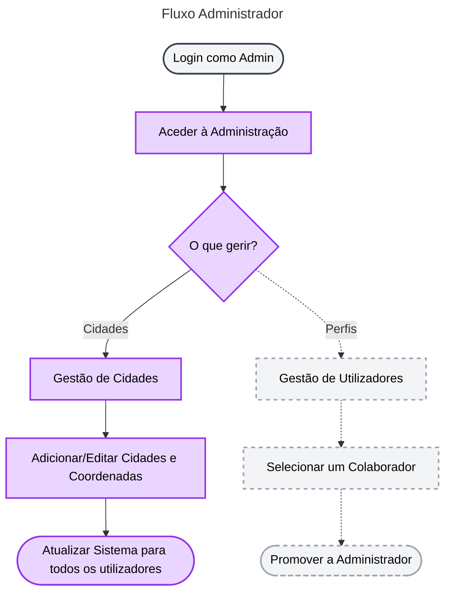

```mermaid
---
title: Fluxo Administrador
---
graph TD
    %% Estilos
    classDef login fill:#f3f4f6,stroke:#374151,stroke-width:2px,color:#000
    classDef admin fill:#e9d5ff,stroke:#9333ea,stroke-width:2px,color:#000
    classDef futuro fill:#f3f4f6,stroke:#9ca3af,stroke-width:2px,stroke-dasharray: 5 5,color:#000

    %% Ponto de Entrada
    A([Login como Admin]) --> B[Aceder à Administração]
    B --> C{O que gerir?}

    %% Fluxo Atual (Cidades)
    C -->|Cidades| D[Gestão de Cidades]
    D --> E[Adicionar/Editar Cidades e Coordenadas]
    E --> F([Atualizar Sistema para todos os utilizadores])

    %% Fluxo Futuro (Perfis - Roadmap)
    C -.->|Perfis| G[Gestão de Utilizadores]
    G -.-> H[Selecionar um Colaborador]
    H -.-> I([Promover a Administrador])

    %% Aplicar Classes (Cores)
    class A login;
    class B,C,D,E,F admin;
    class G,H,I futuro;
```