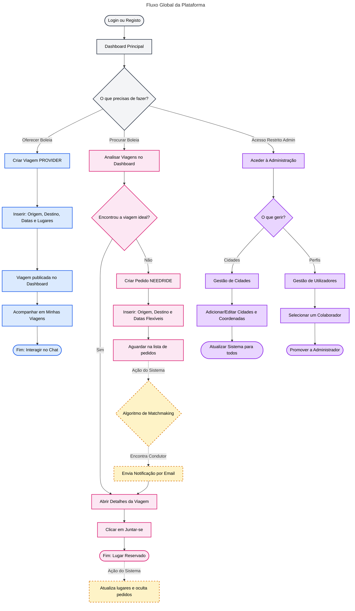

```mermaid
---
title: Fluxo Global da Plataforma
---
graph TD
    %% Estilos
    classDef login fill:#f3f4f6,stroke:#374151,stroke-width:2px,color:#000
    classDef condutor fill:#dbeafe,stroke:#2563eb,stroke-width:2px,color:#000
    classDef passageiro fill:#fce7f3,stroke:#db2777,stroke-width:2px,color:#000
    classDef admin fill:#e9d5ff,stroke:#9333ea,stroke-width:2px,color:#000
    classDef sistema fill:#fef3c7,stroke:#d97706,stroke-width:2px,stroke-dasharray: 5 5,color:#000

    %% Estrutura Base Unificada
    A([Login ou Registo]) --> B[Dashboard Principal]
    B --> C{O que precisas de fazer?}

    %% FLUXO DO CONDUTOR (Acesso: Todos)
    C -->|Oferecer Boleia| D[Criar Viagem PROVIDER]
    D --> E[Inserir: Origem, Destino, Datas e Lugares]
    E --> F[Viagem publicada no Dashboard]
    F --> G[Acompanhar em Minhas Viagens]
    G --> H([Fim: Interagir no Chat])

    %% FLUXO DO PASSAGEIRO (Acesso: Todos)
    C -->|Procurar Boleia| I[Analisar Viagens no Dashboard]
    I --> J{Encontrou a viagem ideal?}

    J -->|Sim| K[Abrir Detalhes da Viagem]
    K --> L[Clicar em Juntar-se]
    L --> M([Fim: Lugar Reservado])
    M -.->|Ação do Sistema| N[Atualiza lugares e oculta pedidos]

    J -->|Não| O[Criar Pedido NEEDRIDE]
    O --> P[Inserir: Origem, Destino e Datas Flexíveis]
    P --> Q[Aguardar na lista de pedidos]
    
    %% O Sistema
    Q -.->|Ação do Sistema| R{Algoritmo de Matchmaking}
    R -.->|Encontra Condutor| S[Envia Notificação por Email]
    S --> K

    %% FLUXO DE ADMINISTRAÇÃO (Acesso: Restrito)
    C -->|Acesso Restrito Admin| T[Aceder à Administração]
    T --> U{O que gerir?}

    U -->|Cidades| V[Gestão de Cidades]
    V --> W[Adicionar/Editar Cidades e Coordenadas]
    W --> X([Atualizar Sistema para todos])

    U -->|Perfis| Y[Gestão de Utilizadores]
    Y --> Z[Selecionar um Colaborador]
    Z --> AA([Promover a Administrador])

    %% Aplicar as classes
    class A,B,C login;
    class D,E,F,G,H condutor;
    class I,J,K,L,M,O,P,Q passageiro;
    class N,R,S sistema;
    class T,U,V,W,X,Y,Z,AA admin;
```